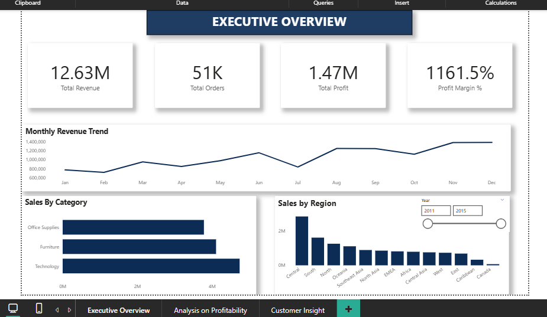
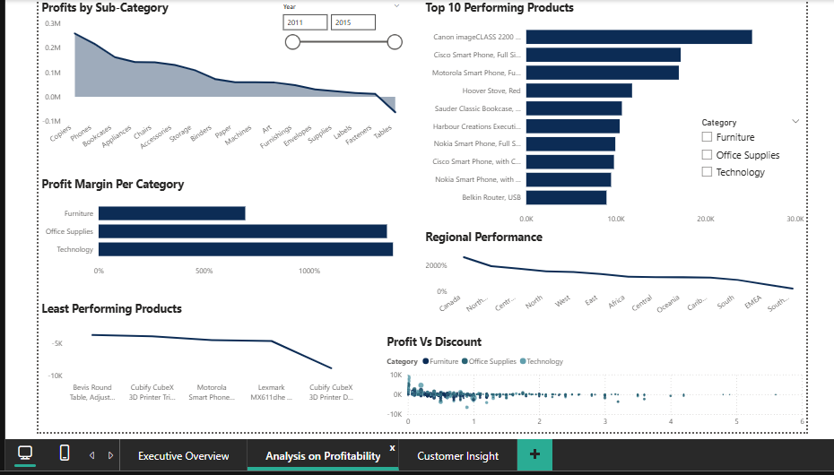
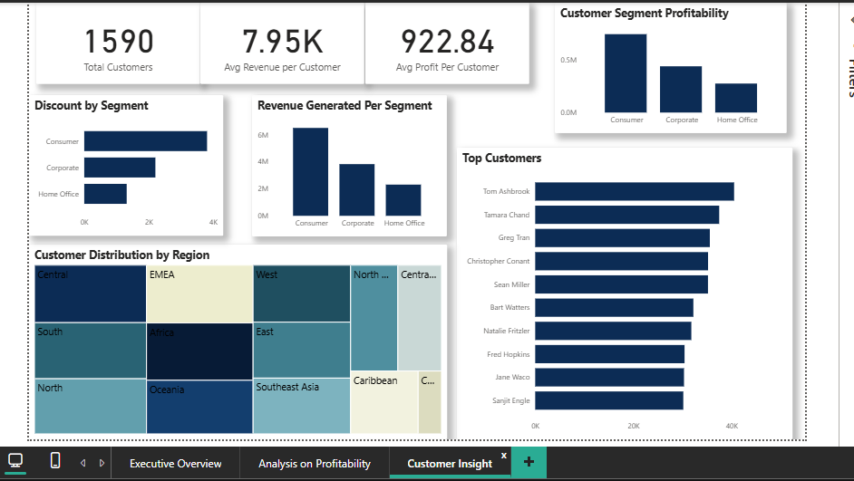

# Novamart-Retail-Stores-Sales-and-Profitability-Analysis
## Project Overview
Novamart retail group is experiencing a decline in Profit Margins and fluctuating revenue despite sales growth.The objective of this project is to analyze sales, profitability, and discount patterns using Excel, SQL Server, and Power BI to uncover performance drivers and provide strategic recommendations.
## Tools Used
Excel- Data Cleaning,
SQL- Data exploration and analysis,
PowerBi- Data Visualization
## Problem Statement
Revenue is growing but profit margin appears unstable.
Management lacks visibility into Regional performance, Product-level profitability and Impact of discounts.
## Dataset Description
Source: Global Superstore dataset,
Number of rows: 51,248,
Number of columns: 27,
Key fields:
Sales,
Profit,
Discount,
Category,
Region,
Order Date
## [Data Cleaning and preparation with Excel](Cleaned_Global_Superstore2.csv)
The dataset initially contained 51,291 rows and 24 columns, covering sales, profit, product, customer, region, and date information.

Key cleaning steps included:
- Verified data quality: No missing values were found in key fields such as Sales, Profit, Discount, Category, Region, and Order Date  
- Removed duplicates: 42 duplicate records identified using Order ID and Product Name were eliminated  
- Standardized date formats: Unified inconsistent date formats into a single Excel date format  
- Created calculated columns:
  - Profit Margin (%) = Profit / Sales  
  - Month-Year for time-based analysis  
  - Year for trend analysis

     After cleaning, the dataset was reduced to 51,248 rows
## SQL Analysis
[Regional Analysis](Regional Analysis.sql)

The dataset was analyzed using SQL Server to evaluate sales performance, profitability, regional trends, product performance, and risk factors.

Key steps and insights:
- Created a database (NovaMartDB) and imported the dataset for analysis  
- Revenue & Profitability: Total revenue of 12.63M and profit of 1.47M, with an overall profit margin of 11.61% (moderate performance)  
- Regional Analysis: Central region recorded the highest revenue and profit margin, while regions such as South, EMEA, and Southeast Asia showed lower profitability (below 10%)  
- Product Performance: Technology category led in both revenue and profitability (with Phones as the top sub-category). Office Supplies showed stable margins, while Furniture had high revenue but low profit margin (~6.97%)  
- Time Trends: Analyzed monthly and yearly performance patterns to identify sales trends  
- Loss & Risk Analysis: Identified 12,499 loss-making orders, with Furniture contributing the most losses. High discounting was a key factor reducing profit margins  

These insights provided a deeper understanding of business performance and key areas for improvement.
## [Data Visualization with PowerBI](Cleaned_Global_Superstore2_powerbi.xlsx.pbix)
The final stage of the project involved building an interactive Power BI dashboard to visualize insights and support data-driven decision-making.

Key steps:
- Imported the cleaned dataset and developed a structured data model  
- Created DAX measures including Total Revenue, Total Profit, Profit Margin, Average Discount, and Total Customers  
- Designed an interactive dashboard to analyze sales performance, profitability trends, and customer behavior  

The dashboard was organized into key analytical sections:
- Executive Overview
  
  
- Retail Performance & Profitability Analysis
  
  
- Customer Insights
   

This dashboard provides a comprehensive and user-friendly view of business performance, enabling stakeholders to make informed decisions.

